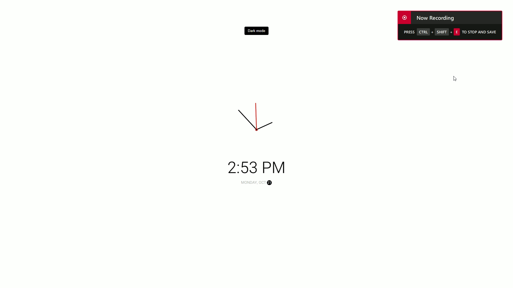

# Minimalist Clock
  

## Live Demo [here](https://minimalist14clock.netlify.app).

## Description

**Minimalist Clock** is a simple and elegant web application that displays the current time and date. It features a dark mode toggle, allowing users to switch between light and dark themes for a better viewing experience. The clock uses smooth animations for the hands and provides an aesthetically pleasing interface.

## Features

- **Current Time Display:** Shows the current hour, minute, and second.
- **Date Display:** Displays the current day of the week and date.
- **Dark Mode Toggle:** Switch between light and dark themes with a single button click.
- **Smooth Animations:** Clock hands move smoothly to reflect the current time.

## Technologies Used

This project utilizes the following technologies:
- **HTML:** For the basic structure of the application.
- **CSS:** For styling and visual presentation.
- **JavaScript:** For application logic, time calculations, and DOM manipulation.
